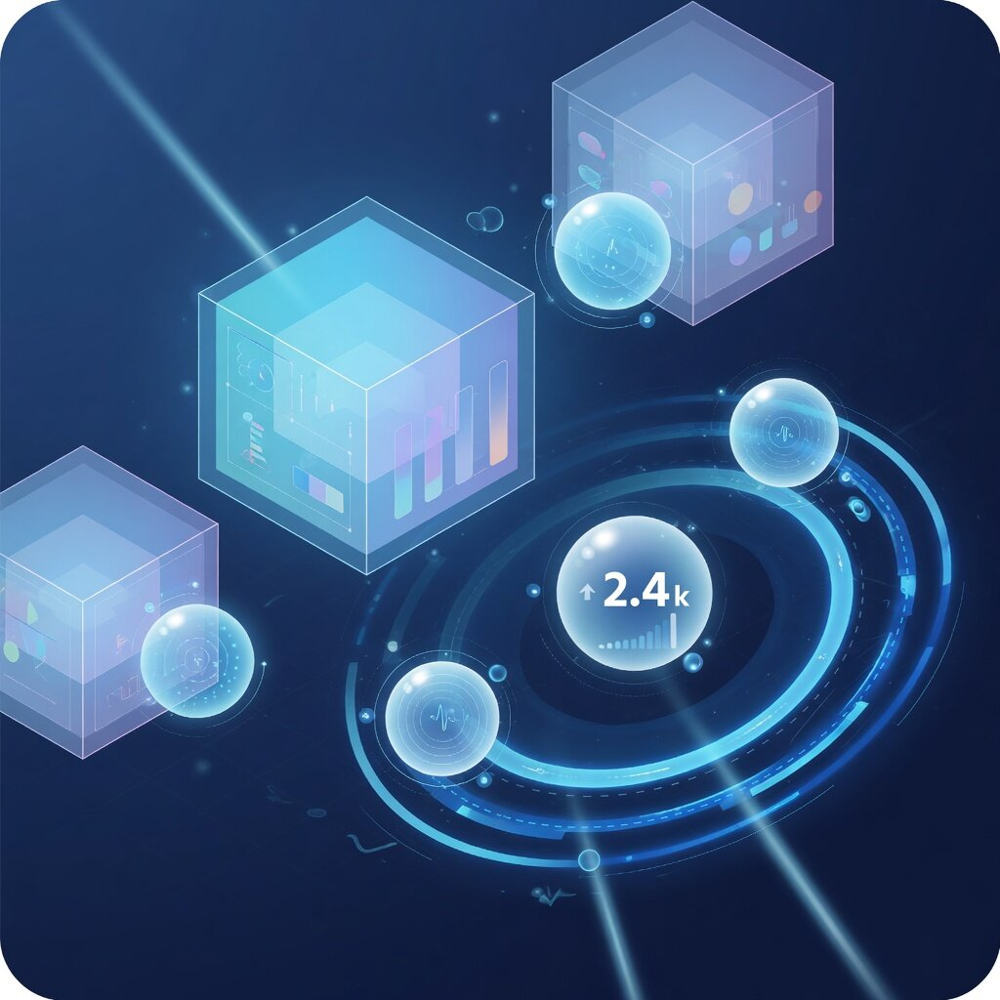

# ohmy-seo

<p align="center">
  
</p>

<p align="center">
  <strong>Монорепозиторий MCP-серверов</strong> для SEO и performance-маркетинга:<br>
  Яндекс (Директ, Метрика, Вебмастер), Google (Search Console, GA4, Tag Manager)<br>
  и сторонние SERP/keyword-инструменты.
</p>

<p align="center">
  <a href="#лицензия">MIT © Кирилл Вечкасов</a> ·
  <a href="https://github.com/VKirill">@VKirill</a> ·
  v0.8.0
</p>

Серверы рассчитаны на LLM-агентов (Claude Code, Claude Desktop и любой MCP-клиент): читать и безопасно писать в живые рекламные и аналитические кабинеты.

Флагман — **`mcp-yandex-seo`**: полный «ручной» инструментарий по **Яндекс Директу** вокруг современной **Единой перформанс-кампании (ЕПК)** и комбинаторных объявлений `RESPONSIVE_AD`.

> ⚠️ Серверы работают с **живыми рекламными аккаунтами**. Любая мутация закрыта флагами окружения **и** явным подтверждением на каждый вызов (см. [Безопасность](#безопасность)). Токены шифруются на диске.

---

## Пакеты

| | Пакет | Версия | MCP-сервер | Назначение |
|---|---|---|---|---|
|  | `@ohmy-seo/yandex-seo` | **0.8.0** | `mcp-yandex-seo` | **Яндекс Директ (ЕПК/комбинаторика), Метрика, Вебмастер** |
|  | `@ohmy-seo/mutagen` | 0.1.0 | `mcp-mutagen` | Оценка конкуренции ключей (Mutagen.ru) |
|  | `@ohmy-seo/xmlstock` | 0.2.0 | `mcp-xmlstock` | SERP-данные (XMLStock API) |
|  | `@ohmy-seo/google-search-console` | 0.1.0 | `mcp-gsc` | Google Search Console + Indexing API |
|  | `@ohmy-seo/ga4` | 0.1.0 | `mcp-ga4` | GA4 Data API + Admin API |
|  | `@ohmy-seo/gtm` | 0.1.0 | `mcp-gtm` | Google Tag Manager (чтение / запись / publish / rollback) |
| | `@ohmy-seo/mcp-core` | 0.3.0 | — | Общая инфраструктура: шифрованное OAuth-хранилище, SQLite-кэш, big-int-safe JSON, базовые типы |

---

## Флагман: Яндекс Директ (`mcp-yandex-seo`)

<p align="center">
  
  &nbsp;
  
</p>

В Директе все форматы сведены в **ЕПК**. Классические однозаголовочные ТГО (`TextAd`) и баннеры РСЯ (`TextImageAd`) устарели. Этот сервер — **только комбинаторика**: каждое объявление — `RESPONSIVE_AD` с пулом **1–7 заголовков × 1–3 текстов** (Яндекс сам собирает лучшую связку) через API `/json/v501/`.

Что умеет (проверено на живом API):

- **Создание** — ЕПК-кампании, группы, комбинаторные объявления, быстрые ссылки, уточнения, промо, картинки; либо целая кампания из **YAML-бандла** (`upload_from_yaml`: dry-run → plan-hash → live).
- **Точечное редактирование** — `update_campaign` / `update_adgroup` / `update_ad` меняют только переданные поля (ID объявлений — строки: они больше 2⁵³).
- **Стратегии ставок** — типизированный `strategy`: ручная (`HIGHEST_POSITION`), макс. клики, средний CPC, макс. конверсии, средний CPA, оплата за конверсию, ДРР/CRR. Собирает совместимую пару `{ Search, Network }`.
- **Корректировки** — mobile / desktop / video через `set_bid_modifiers`.
- **Таргетинг** — минус-фразы кампании и группы (replace/append), исключённые площадки РСЯ, расширенная география, почасовое расписание, модель атрибуции.
- **Конверсии** — счётчик Метрики + цели + ценность цели; стратегии «оплата за конверсию» / target-CPA.
- **Товарные фиды** — `feeds` (add/get/update/delete) со статусом модерации.
- **Чтение и отчёты** — кампании, группы, объявления, ключи, статистика (Reports v5), поисковые запросы, история изменений, выгрузка XLSX.
- **Escape hatch** — `yandex_direct_api`, сырой шлюз к любому методу Direct v5/v501.

Валюта не зафиксирована (RUB, USD, EUR, …): деньги — целые **микроединицы**, минимумы из `Dictionaries.get{Currencies}`.

**Скилл для агента:** в [`skills/ohmy-seo-mcp/`](skills/ohmy-seo-mcp/) — каталог инструментов, рецепт загрузки, playbook point-editing, паттерн безопасности и `references/` с проверенными quirks API. Скопируйте в каталог skills Claude/агента, чтобы сервер использовался «из коробки».

---

## Приложения

### Mutagen — конкуренция ключей

<p align="center"></p>

Оценка конкурентности фраз через Mutagen.ru. Подключается как отдельный `mcp-mutagen` и как инструменты внутри `mcp-yandex-seo`.

### XMLStock — SERP

<p align="center"></p>

Данные поисковой выдачи через XMLStock API: сниппеты, позиции, разбор SERP.

### Google Search Console

<p align="center"></p>

Поисковая аналитика, инспекция URL, Indexing API. OAuth или Service Account.

### GA4

<p align="center"></p>

Отчёты Data API и Admin API: измерения, метрики, realtime, drill-down.

### Google Tag Manager

<p align="center"></p>

Контейнеры, теги, триггеры, переменные: чтение, запись, публикация и откат версий.

---

## Требования

- **Node.js ≥ 22**
- **pnpm** (`npm i -g pnpm`)

## Установка и сборка

```bash
git clone https://github.com/VKirill/ohmy-seo.git
cd ohmy-seo
pnpm install
pnpm -r build          # dist/ для всех пакетов
pnpm -r test           # опционально: тесты
```

## Конфигурация

Каждый сервер читает `.env` из каталога пакета. Скопируйте пример и заполните:

```bash
cp packages/yandex-seo/.env.example packages/yandex-seo/.env
```

Обязательно для `mcp-yandex-seo`:

| Переменная | Назначение |
|---|---|
| `MCP_YANDEX_SEO_MASTER_KEY` | 32-байтный hex-ключ AES-256-GCM для токенов и client secret. `openssl rand -hex 32`. **Храните отдельно: без него токены не восстановить.** |
| `OHMY_SEO_ALLOW_LIVE_MUTATIONS` | Глобальный kill-switch — `true` для **любой** записи. Без него — только чтение. |
| `YANDEX_DIRECT_ALLOW_LIVE_MUTATIONS` | Флаг записи именно для Яндекс Директа. |

Опционально: `MUTAGEN_API_KEY`, `XMLSTOCK_USER` + `XMLSTOCK_KEY`. Google-пакеты — OAuth или Service Account (см. `.env.example` пакета).

## Подключение OAuth

**Яндекс** — через инструменты сервера:

1. `register_oauth_app` — сохранить OAuth-приложение (client_id + client_secret, в шифрованном виде).
2. `start_oauth_flow` — получить URL согласия, подтвердить в браузере.
3. `complete_oauth_flow` — обменять code на токены.
4. `list_accounts` / `set_default_account` — управление аккаунтами. Метка аккаунта — параметр `account`; для агентских подкабинетов — `client_login`.

**Google** — `register_google_oauth_app` → `start_google_oauth_flow` → `complete_google_oauth_flow`, либо `register_google_service_account`.

## Подключение к MCP-клиенту

Каждый сервер — stdio-процесс на собранный `dist/index.js`. Пример для Claude Desktop / любого MCP-клиента:

```json
{
  "mcpServers": {
    "mcp-yandex-seo": {
      "command": "node",
      "args": ["/absolute/path/to/ohmy-seo/packages/yandex-seo/dist/index.js"]
    }
  }
}
```

Для **Claude Code**:

```bash
claude mcp add mcp-yandex-seo -- node /absolute/path/to/ohmy-seo/packages/yandex-seo/dist/index.js
```

После подключения перезапустите клиент — инструменты обнаруживаются при соединении.

---

## Безопасность

Запись в живой кабинет — оборона в глубину:

1. **Глобальный флаг** — `OHMY_SEO_ALLOW_LIVE_MUTATIONS=true` (без него записи нет).
2. **Флаг платформы** — `YANDEX_DIRECT_ALLOW_LIVE_MUTATIONS=true`.
3. **`confirm: true`** на каждом мутирующем инструменте.
4. **`acknowledge_live`** — строка подтверждения для опасных операций (delete, pause, moderate, budget, удаление корректировок); инструмент ожидает точную фразу.

Рекомендуемый паттерн для агентов: создавать кампании в **DRAFT/OFF**, только поиск, ручная стратегия или низкий недельный лимит, **без автомодерации и автозапуска** — человек подтверждает перед live. Read-only (`list_*`, `get_*`, mode `get`) флаги не требует.

## Заметки по безопасности

- Access/refresh-токены и client secret **шифруются AES-256-GCM** в локальной SQLite (`data/state.db`, в git не попадает). Инструменты их не возвращают.
- `.env`, `data/` и Google `client_secret_*.json` в `.gitignore`. Не коммитьте.
- `MCP_YANDEX_SEO_MASTER_KEY` — корень доверия; храните вне репозитория.

---

## Разработка

```bash
pnpm -r build                                  # собрать всё
pnpm --filter @ohmy-seo/yandex-seo test        # тесты одного пакета
pnpm -r exec tsc --noEmit                      # typecheck
```

Пакет Яндекс Директа: `src/registry/*` (регистрация по доменам), `src/tools/*` (один файл — один tool), `src/lib/payloads/*` (сборщики payload), `src/lib/pipeline/*` (движок YAML-загрузки). Перед новым кодом по Direct — [`skills/ohmy-seo-mcp/references/yandex-direct-api-quirks.md`](skills/ohmy-seo-mcp/references/yandex-direct-api-quirks.md).

---

## Авторские права

**Copyright © 2026 Кирилл Вечкасов (Kirill Vechkasov, [@VKirill](https://github.com/VKirill))**

Все права на исходный код, документацию, bundled skill и иллюстрации в `docs/assets/` принадлежат автору, если иное не указано явно. Сторонние API (Яндекс, Google, Mutagen, XMLStock) — товарные знаки соответствующих правообладателей; проект с ними не аффилирован.

## Лицензия

[MIT](LICENSE) © 2026 Кирилл Вечкасов (Kirill Vechkasov, VKirill)

Разрешено использовать, копировать, изменять и распространять при сохранении уведомления об авторских правах и текста лицензии MIT.
