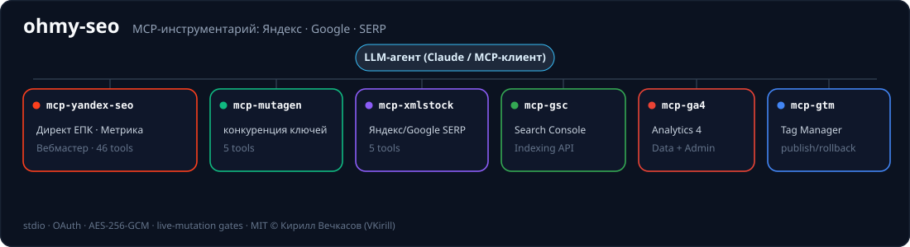
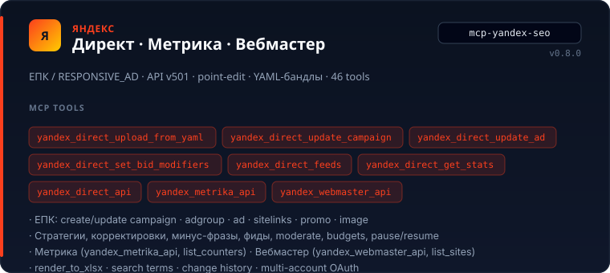
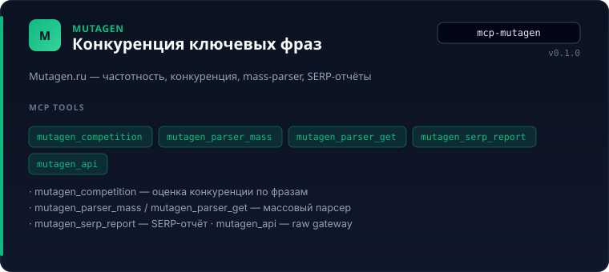
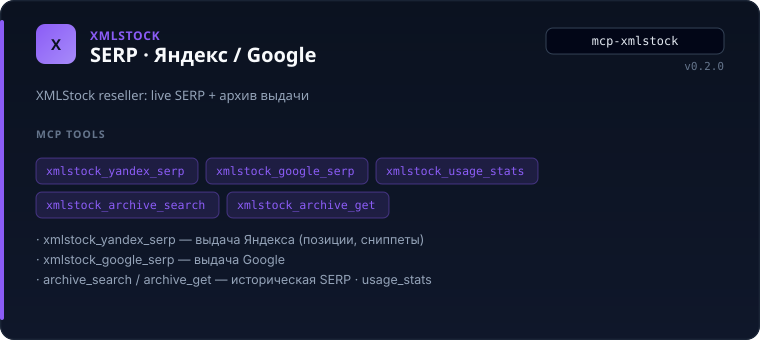
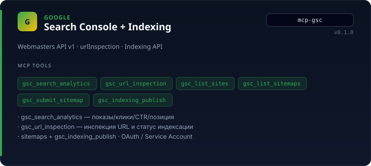
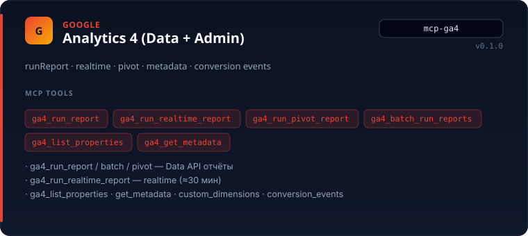
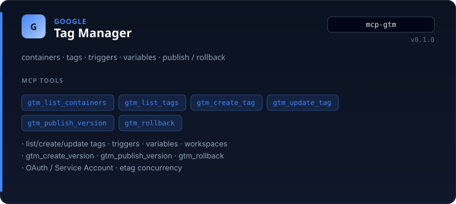

# ohmy-seo

<p align="center">
  
</p>

**Монорепозиторий MCP-серверов** для SEO и performance-маркетинга. Агент (Claude Code / Claude Desktop / любой MCP-клиент) получает «руки» к живым кабинетам:

| Платформа | Сервер | Что делает |
|---|---|---|
| **Яндекс** | `mcp-yandex-seo` | Директ (ЕПК), Метрика, Вебмастер |
| **[Mutagen.ru](https://mutagen.ru/?r=69383)** | `mcp-mutagen` | конкуренция ключей, mass-parser, SERP-отчёты |
| **[XMLStock](https://xmlstock.com/?ref=vechkasov)** | `mcp-xmlstock` | live SERP Яндекс/Google + архив |
| **Google** | `mcp-gsc` · `mcp-ga4` · `mcp-gtm` · `mcp-google-ads` | Search Console, Analytics 4, Tag Manager, Google Ads |
| **Roistat** | `mcp-roistat` | read-only сквозная аналитика, метрики и измерения |

> ⚠️ Серверы ходят в **живые** рекламные и аналитические аккаунты. Запись закрыта env-флагами **и** `confirm` на каждый вызов. Токены — AES-256-GCM в локальной SQLite.

**MIT © 2026 [Кирилл Вечкасов](https://github.com/VKirill)** · v0.9.0

---

## Пакеты

| Пакет | Версия | MCP | Назначение |
|---|---|---|---|
| `@ohmy-seo/yandex-seo` | **0.8.0** | `mcp-yandex-seo` | Яндекс Директ (ЕПК/комбинаторика), Метрика, Вебмастер |
| `@ohmy-seo/mutagen` | 0.1.0 | `mcp-mutagen` | Конкуренция ключей ([Mutagen.ru](https://mutagen.ru/?r=69383)) |
| `@ohmy-seo/xmlstock` | 0.2.0 | `mcp-xmlstock` | SERP Яндекс/Google ([XMLStock](https://xmlstock.com/?ref=vechkasov)) |
| `@ohmy-seo/google-search-console` | 0.1.0 | `mcp-gsc` | Google Search Console + Indexing API |
| `@ohmy-seo/ga4` | 0.1.0 | `mcp-ga4` | GA4 Data API + Admin API |
| `@ohmy-seo/gtm` | 0.1.0 | `mcp-gtm` | Google Tag Manager (read/write/publish/rollback) |
| `@ohmy-seo/google-ads` | 0.1.0 | `mcp-google-ads` | Google Ads API v25 (GAQL, отчёты, мутации с двухшаговым подтверждением) |
| `@ohmy-seo/roistat` | 0.1.0 | `mcp-roistat` | Read-only Roistat API: проекты, поля аналитики и отчёты |
| `@ohmy-seo/mcp-core` | 0.3.0 | — | OAuth storage, SQLite cache, big-int JSON, base types |

---

## `mcp-yandex-seo` — флагман (Яндекс)



### Яндекс Директ (ЕПК)

В Директе форматы сведены в **Единую перформанс-кампанию**. Сервер — **только комбинаторика**: `RESPONSIVE_AD` с пулом **1–7 заголовков × 1–3 текстов** через `/json/v501/`. Классические `TextAd` / `TextImageAd` не используются.

| Область | Tools (реальные имена) |
|---|---|
| Загрузка кампании | `yandex_direct_upload_from_yaml`, `yandex_direct_upload_campaign_bundle`, `yandex_direct_render_to_xlsx` |
| Создание | `yandex_direct_create_campaign`, `…_adgroup`, `…_ad_unified`, `…_sitelinks_set`, `…_promo_extension`, `…_upload_image` |
| Point-edit | `yandex_direct_update_campaign`, `…_adgroup`, `…_ad`, `…_budgets`, `…_adgroup_autotargeting` |
| Ставки / корректировки | `yandex_direct_set_bid_modifiers` (mobile/desktop/video), typed `strategy` |
| Управление | `yandex_direct_pause_campaigns`, `…_resume_campaigns`, `…_delete_campaigns`, `…_moderate_ads` |
| Таргет / минус | `yandex_direct_negative_keywords_add`, `…_feeds` |
| Чтение / отчёты | `yandex_direct_list_*`, `…_get_stats`, `…_get_search_terms`, `…_get_change_history` |
| Raw API | `yandex_direct_api` (любой метод v5/v501) |

Деньги — целые **микроединицы** (RUB/USD/EUR…), минимумы из `Dictionaries.get{Currencies}`.

### Яндекс Метрика и Вебмастер

| Область | Tools |
|---|---|
| Метрика | `yandex_metrika_api`, `list_counters`, `yandex_direct_link_metrika_goals` |
| Вебмастер | `yandex_webmaster_api`, `list_sites`, `find_property` |
| Инвентарь / кэш | `refresh_inventory`, `cache_stats`, `invalidate_cache` |
| OAuth | `register_oauth_app` → `start_oauth_flow` → `complete_oauth_flow`, multi-account |

**Скилл агента:** [`skills/ohmy-seo-mcp/`](skills/ohmy-seo-mcp/) — каталог tools, YAML-рецепт, point-edit playbook, [API quirks](skills/ohmy-seo-mcp/references/yandex-direct-api-quirks.md).

---

## `mcp-mutagen` — конкуренция ключей



Сервис: **[Mutagen.ru](https://mutagen.ru/?r=69383)** (реф-ссылка).

| Tool | Назначение |
|---|---|
| `mutagen_competition` | конкуренция / частотность по фразам |
| `mutagen_parser_mass` / `mutagen_parser_get` | массовый парсер |
| `mutagen_serp_report` | SERP-отчёт |
| `mutagen_api` | raw gateway к API Mutagen.ru |

Нужен `MUTAGEN_API_KEY` — ключ в [личном кабинете Mutagen](https://mutagen.ru/?r=69383).

---

## `mcp-xmlstock` — SERP Яндекс / Google



Сервис: **[XMLStock](https://xmlstock.com/?ref=vechkasov)** (реф-ссылка).

| Tool | Назначение |
|---|---|
| `xmlstock_yandex_serp` | live-выдача Яндекса (позиции, сниппеты) |
| `xmlstock_google_serp` | live-выдача Google |
| `xmlstock_archive_search` / `xmlstock_archive_get` | историческая SERP |
| `xmlstock_usage_stats` | расход лимитов |

Нужны `XMLSTOCK_USER` + `XMLSTOCK_KEY` — регистрация и ключи на [xmlstock.com](https://xmlstock.com/?ref=vechkasov).

---

## Google: Search Console · GA4 · GTM · Ads

### `mcp-gsc` — Search Console + Indexing



| Tool | Назначение |
|---|---|
| `gsc_search_analytics` | показы, клики, CTR, позиция (page/query/device/country) |
| `gsc_url_inspection` | инспекция URL, статус индексации |
| `gsc_list_sites` | список property |
| `gsc_list_sitemaps` / `gsc_submit_sitemap` / `gsc_delete_sitemap` | sitemap |
| `gsc_indexing_publish` | Indexing API |

### `mcp-ga4` — Analytics 4



| Tool | Назначение |
|---|---|
| `ga4_run_report` / `ga4_batch_run_reports` / `ga4_run_pivot_report` | Data API |
| `ga4_run_realtime_report` | realtime (~30 мин) |
| `ga4_list_properties` | property lookup |
| `ga4_get_metadata` | dimensions/metrics metadata |
| `ga4_list_custom_dimensions` / `ga4_list_conversion_events` | Admin API |

### `mcp-gtm` — Tag Manager



| Tool | Назначение |
|---|---|
| `gtm_list_containers` / `gtm_list_workspaces` | структура аккаунта |
| `gtm_list_tags` / `gtm_create_tag` / `gtm_update_tag` / `gtm_delete_tag` | теги |
| `gtm_list_triggers` / `gtm_create_trigger` | триггеры |
| `gtm_list_variables` / `gtm_create_variable` | переменные |
| `gtm_create_version` / `gtm_publish_version` / `gtm_rollback` | релизы |

Google-пакеты: OAuth (`register_google_oauth_app` → `start_google_oauth_flow` → `complete_google_oauth_flow`) или `register_google_service_account`.

### `mcp-google-ads` — Google Ads API v25

44 инструмента: аккаунты, GAQL, отчёты, метаданные полей и управляемые мутации. Любая реальная запись требует `confirm:true` и `GOOGLE_ADS_ALLOW_LIVE_MUTATIONS=true`; опасные операции дополнительно требуют `acknowledge_live` с ID аккаунта и ресурса. Пакет пока подключается как отдельный локальный MCP-сервер и не включён в hosted OAuth автоматически.

---

## `mcp-roistat` — сквозная аналитика

Отдельный от Яндекса read-only сервер. Он предоставляет только три явно разрешённых инструмента: список проектов, справочники аналитики и получение отчёта. Произвольных endpoint и write-операций нет. Нужны `ROISTAT_API_KEY` и, для проектных запросов, `ROISTAT_PROJECT_ID`.

---

## Установка

```bash
git clone https://github.com/VKirill/ohmy-seo.git
cd ohmy-seo
pnpm install          # Node.js ≥ 22, pnpm
pnpm -r build
pnpm -r test          # опционально
```

### Конфиг `mcp-yandex-seo`

```bash
cp packages/yandex-seo/.env.example packages/yandex-seo/.env
```

| Переменная | Назначение |
|---|---|
| `MCP_YANDEX_SEO_MASTER_KEY` | 32-byte hex AES-256-GCM (`openssl rand -hex 32`). Без ключа токены не восстановить. |
| `OHMY_SEO_ALLOW_LIVE_MUTATIONS` | глобальный kill-switch записи (`true` / unset = read-only) |
| `YANDEX_DIRECT_ALLOW_LIVE_MUTATIONS` | запись в Яндекс Директ |

Опционально:
- `MUTAGEN_API_KEY` — ключ [Mutagen.ru](https://mutagen.ru/?r=69383)
- `XMLSTOCK_USER` + `XMLSTOCK_KEY` — аккаунт [XMLStock](https://xmlstock.com/?ref=vechkasov)
- `ROISTAT_API_KEY` + `ROISTAT_PROJECT_ID` — отдельный `mcp-roistat`

Google — см. `.env.example` пакета.

### OAuth (Яндекс)

1. `register_oauth_app` — client_id + client_secret (шифруются)
2. `start_oauth_flow` → браузер
3. `complete_oauth_flow` → токены
4. `list_accounts` / `set_default_account`; для агентств — `client_login`

### MCP-клиент

```json
{
  "mcpServers": {
    "mcp-yandex-seo": {
      "command": "node",
      "args": ["/absolute/path/to/ohmy-seo/packages/yandex-seo/dist/index.js"]
    }
  }
}
```

```bash
claude mcp add mcp-yandex-seo -- node /absolute/path/to/ohmy-seo/packages/yandex-seo/dist/index.js
```

После подключения перезапустите клиент.

---

## Как устроен MCP-сервер

Каждый пакет — отдельный **stdio-процесс**: клиент запускает `node dist/index.js`,
общается по JSON-RPC через stdin/stdout, сервер держит собственное состояние в
SQLite. Общего демона нет, пакеты друг о друге не знают.

### Состояние и переменные окружения

У каждого пакета свой префикс переменных, `MCP_<PACKAGE>_MASTER_KEY` и
`MCP_<PACKAGE>_DB_PATH`:

| Пакет | Префикс |
|---|---|
| `yandex-seo` | `MCP_YANDEX_SEO` |
| `google-search-console` | `MCP_GSC` |
| `ga4` | `MCP_GA4` |
| `gtm` | `MCP_GTM` |
| `google-ads` | `MCP_GOOGLE_ADS` |
| `mutagen` | `MCP_MUTAGEN` |
| `xmlstock` | `MCP_XMLSTOCK` |

`MASTER_KEY` — 32 байта hex, AES-256-GCM. Им шифруются `client_secret`,
access- и refresh-токены; формат блоба — `iv(12) ‖ ciphertext ‖ tag(16)`.
Ключ нигде не хранится: потеряете — токены не восстановить, все аккаунты
придётся авторизовать заново. `DB_PATH` по умолчанию `./data/state.db`.

### Схема SQLite

- `oauth_apps` / `accounts` — приложение и аккаунты Яндекса (`accounts.label`
  уникален; `is_default` помечает аккаунт по умолчанию)
- `google_oauth_apps` / `google_accounts` — то же для Google, плюс
  `auth_method` (`oauth_user` или `service_account`)
- `inv_sites` / `inv_counters` — инвентарь сайтов Вебмастера и счётчиков Метрики
- `query_cache` — кеш ответов с TTL на инструмент
- `gtm_rollback_plans` — планы отката версий контейнеров

`expires_at` везде хранится **в секундах** Unix-времени.

### Жизненный цикл токена

Перед каждым вызовом API сервер берёт аккаунт из базы, расшифровывает токен и
проверяет срок. Если до истечения больше 5 минут — токен используется как есть;
иначе выполняется refresh. Одновременные вызовы одного аккаунта делят один
запрос обновления (мьютекс по `accountId`), разные аккаунты обновляются
параллельно. Брокер токенов ничего не пишет в базу — сохранение результата
лежит на вызывающем коде.

### Мультиарендность

Пакеты не знают про пользователей: изоляция достигается снаружи — отдельный
`DB_PATH` и отдельный `MASTER_KEY` на каждого арендатора. Так работает
хостинговый шлюз [ohmy-seo.ru](https://ohmy-seo.ru): он материализует
`state.db` под пользователя, кладёт туда свежие access-токены и поднимает
обычные stdio-серверы, поэтому все инструменты работают без изменений.
Refresh-токены при этом остаются на стороне шлюза.

### Кеш

Читающие инструменты кешируются в `query_cache` с TTL из
`MCP_<PACKAGE>_CACHE_TTL_*`. Ключ включает имя инструмента, аккаунт и
нормализованные аргументы. Статистика — `cache_stats`, сброс —
`invalidate_cache`.

---

## Безопасность записи

1. `OHMY_SEO_ALLOW_LIVE_MUTATIONS=true`
2. `YANDEX_DIRECT_ALLOW_LIVE_MUTATIONS=true` (платформенный флаг)
3. `confirm: true` на каждом mutating tool
4. `acknowledge_live` — точная строка для delete / pause / moderate / budget / удаления корректировок

Рекомендация агентам: создавать в **DRAFT/OFF**, только поиск, ручная/низкий weekly cap, **без автомодерации и автозапуска**.

Токены и client secret — в `data/state.db` (AES-256-GCM, gitignored). `.env` и `client_secret_*.json` не коммитить.

---

## Разработка

```bash
pnpm -r build
pnpm --filter @ohmy-seo/yandex-seo test
pnpm -r exec tsc --noEmit
```

Структура `yandex-seo`: `src/registry/*` · `src/tools/*` · `src/lib/payloads/*` · `src/lib/pipeline/*`.  
Quirks API: [`skills/ohmy-seo-mcp/references/yandex-direct-api-quirks.md`](skills/ohmy-seo-mcp/references/yandex-direct-api-quirks.md).

---

## Авторские права и лицензия

**Copyright © 2026 Кирилл Вечкасов (Kirill Vechkasov, [@VKirill](https://github.com/VKirill))**

Код, документация, skill и ассеты в `docs/assets/` — автора. Товарные знаки Яндекс, Google, Mutagen, XMLStock принадлежат правообладателям; проект с ними не аффилирован.

[MIT](LICENSE) — использование, изменение и распространение с сохранением copyright notice.

## Облачный MCP и личный кабинет

[ohmy-seo.ru/app](https://ohmy-seo.ru/app) — подключение нескольких аккаунтов
Яндекса и Google через OAuth. Создайте персональный API-ключ и подключите
Streamable HTTP MCP: `https://mcp.ohmy-seo.ru/mcp`, заголовок
`Authorization: Bearer <ваш API-ключ>`.

Исходники веб-сервиса, шлюза, синхронизации и инструкция развёртывания:
[hosting/OPERATIONS.md](hosting/OPERATIONS.md). Директ использует отдельное
OAuth-приложение; для его инструментов выбирайте аккаунт с суффиксом `(Директ)`.
